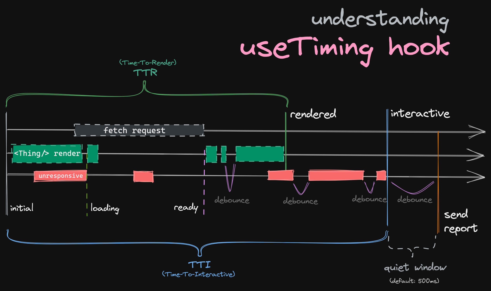

# @zendeskgarden/container-measuretiming [![npm version][npm version badge]][npm version link]

[npm version badge]: https://flat.badgen.net/npm/v/@zendeskgarden/container-measuretiming
[npm version link]: https://www.npmjs.com/package/@zendeskgarden/container-measuretiming

It can be valuable to track durations in which the application is in undesirable states. This
includes states like fetching data, React rendering, DOM painting, and external reasons for slow,
jittery or unresponsive components (e.g. user's browser extension or account's Apps).
Time-to-interactive is an industry standard metric that captures the amount of time it takes the
application to reach a state in which the user can successfully interact with it. It is usually
applied to first page loads. Such timing data can often be used as SLIs, help with debugging issues,
understanding the level of performance across different cohorts of customers, and even serve as a
helpful additional indicator of possible incidents.

The hooks available in this package, are made to capture a TTI-like metric that can be measured on
the much more granular level of a React component. It can be used to capture the time it takes a
component to become interactive, but also user initiated actions, or actions that go through
multiple stages, and time those stages individually.

## Installation

```sh
npm install @zendeskgarden/container-measuretiming
```

## Usage

Check out [storybook](https://zendeskgarden.github.io/react-containers) for live examples.

First, create a file that generates and exports the hooks for your metric ID prefix by using
`generateTimingHooks`.

For example:

```typescript
import { generateTimingHooks } from '@zendeskgarden/container-measuretiming';

export const {
  // the name of the hook(s) are generated based on the `name` and the placement names
  useConversationTimingInConversationPane,
  useConversationTimingInConversation
} = generateTimingHooks(
  {
    name: 'Conversation',
    idPrefix: 'ticket/conversation',
    reportFn: (report, metadata) => {
      // do something with the report, e.g. send select data to Datadog RUM or other analytics
    }
  },
  // name of the first component this hook will be placed in:
  'ConversationPane',
  // any further arguments are name(s) of subsequent beacon placement components:
  'Conversation'
);
```

Then use the hooks in your component(s):

```typescript
import {
  useConversationTimingInConversationPane,
  useConversationTimingInConversation
} from '@zendeskgarden/container-measuretiming';

const ConversationPane = ({ conversationId }) => {
  useConversationTimingInConversationPane({
    metadata: {
      // any metadata you want to pass along to the reportFn
      conversationId
    }
  });

  return (
    <>
      <h2>This is a conversation no. ${conversationId}!</h2>
      <Conversation conversationId={conversationId} />
    </>
  );
};
```

```typescript
import {
  useConversationTimingInConversation,
  useConversationTimingInConversation
} from '@zendeskgarden/container-measuretiming';

const Conversation = ({ conversationId }) => {
  const messages = useMessages(conversationId);
  const conversationType = useConversationType(conversationId);

  useConversationTimingInConversation({
    metadata: {
      // any additional metadata you want to pass along to the reportFn
      conversationType
    }
  });

  return <div>{messages}</div>;
};
```

### Report

Each metric provided in the report is captured in the report, in milliseconds. The two key, summary
metrics are:

- `tti` — time-to-interactive - captures the time from the moment of activation (which is either the
  beginning of the rendering, or based on the state provided to the hook - see below) until the
  component has completed rendering (and re-rendering), and until a specific stage has been reached
  (optional), and finally after all the UI-blocking work has completed. This will not be reported in
  all browsers due to limited support of the `'longtask'` type performance monitoring (only
  Chromium-based as of June 2021).
- `ttr` — time-to-render - the subset of the time captured above, from the beginning of the first
  render, to the end of the last render (of the desired final stage), after which no more re-renders
  had occured during the specified debounce period.



<!-- NOTE: if you need to update the diagram, the PNG file contains an embedded source file that can be opened by excalidraw.com -->

The full report includes individual stage timings and re-render counts. See the
[`Report`](./src/generateReport.ts)'s interface to see what data is available.

The `reportFn` may also be overriden at the call-site of the hook itself (i.e. in the component
render function).

You may also create your own, custom `generateTimingHooksWithCustomReporting` function that
abstracts away the reporting logic for your specific scenario, by for example adding the capability
to provide metadata, local to the call-site.

### Timing component load time

The simplest usage only requires one to define the `placement` of the hook. Every hook that comes
from a single set of generated timings _must_ have a different placement for the hook to work
properly.

```tsx
import { generateTimingHooks } from '@zendeskgarden/container-measuretiming';

export const {
  // the name of the hook(s) are generated based on the `name` and the placement names
  useSomethingLoadingTimingInSomeComponentName
} = generateTimingHooks(
  {
    name: 'SomethingLoading',
    idPrefix: 'some/identifier',
    finalStages: [DEFAULT_STAGES.READY],
    reportFn: myCustomReportFunction
  },
  // name of the first placement
  // usually the component that mounts first, from which timing should start
  'SomeComponentName'
);
```

### Timing component load time from the moment a condition has been satisfied

There will be cases when you don't want to start timing until some condition has been satisfied
(e.g. until a dropdown is actually open).

If `isActive` is present in at least one of the beacons, timing will start from the moment
`isActive` turns true, until either of these situations occur:

- `MyComponent` goes into the final stage
- in case no final stages were defined, finishes rendering and its UI becomes interactive
- `isActive` switches to `false`

```tsx
import { generateTimingHooks } from '@zendeskgarden/container-measuretiming';

export const {
  // the name of the hook(s) are generated based on the `name` and the placement names
  useSomethingLoadingTimingInMyComponent
} = generateTimingHooks(
  {
    name: 'SomethingLoading',
    idPrefix: 'some/identifier',
    reportFn: myCustomReportFunction
  },
  // name of the placement
  'MyComponent'
);

const MyComponent = () => {
  useSomethingLoadingTimingInMyComponent({
    isActive: MY_CONDITION === true
  });
  return <div>Hello!</div>;
};
```

### Timing component loading stages

```tsx
import { generateTimingHooks, DEFAULT_STAGES } from '@zendeskgarden/container-measuretiming';

export const {
  // the name of the hook(s) are generated based on the `name` and the placement names
  useSomethingLoadingTimingInMyComponent
} = generateTimingHooks(
  {
    name: 'SomethingLoading',
    idPrefix: 'some/identifier',
    // when one of these stages is reached, we wait until the rendering settles, and send the metrics
    finalStages: [DEFAULT_STAGES.READY],
    reportFn: myCustomReportFunction
  },
  // name of the placement
  'MyComponent'
);

const MyComponent = () => {
  const { data, loading } = useExternalData();
  useSomethingLoadingTimingInMyComponent({
    isActive: MY_CONDITION === true,
    // e.g. DEFAULT_STAGES.LOADING - or a custom-named stage 'searching':
    stage: loading ? DEFAULT_STAGES.LOADING : DEFAULT_STAGES.READY
  });
  return <div>Hello!</div>;
};
```

#### Handling complex stages in a readable way

If you have more than 2 stages to handle, instead of writing complex ternary expressions, you may
use the provided "functional switch" helper, like in the example below:

```tsx
import {
  generateTimingHooks,
  DEFAULT_STAGES,
  switchFn
} from '@zendeskgarden/container-measuretiming';

export const {
  // the name of the hook(s) are generated based on the `name` and the placement names
  useSomethingLoadingTimingInMyComponent
} = generateTimingHooks(
  {
    name: 'SomethingLoading',
    idPrefix: 'some/identifier',
    // when one of these stages is reached, we wait until the rendering settles, and send the metrics
    finalStages: [DEFAULT_STAGES.READY],
    reportFn: myCustomReportFunction
  },
  // name of the placement
  'MyComponent'
);

const MyComponent = () => {
  useSomethingLoadingTimingInMyComponent({
    isActive: MY_CONDITION === true,
    stage: switchFn(
      { case: !isOpen, return: DEFAULT_STAGES.INACTIVE },
      // custom stage:
      { case: isSearching, return: 'searching' },
      { case: isLoading, return: DEFAULT_STAGES.LOADING },
      { return: DEFAULT_STAGES.READY }
    )
  });
  return <div>Hello!</div>;
};
```

### Usage with beacons - starting the timer elsewhere

Placing beacon hooks in additional components allows you to start/continue the timer and change
stages in a different component. It is also useful in situations where the state of the component
we're interested in tracking may completely be destroyed, and shortly after recreated (which would
mean the state of our hook would also have been destroyed).

You may add however many beacons you like. The primary hook (first placement) also serves the role
of a beacon. Note that if not all beacons are mounted when the final stage is reached (and it is not
an ERROR stage), an error will additionally be reported to RUM.

Note that if you set `stage` in multiple beacons, only the latest _change_ will be taken into
account, so a re-render of a component containing a beacon with a stale `stage` will _not_ cause the
`stage` to switch back (otherwise that would be a race condition).

```tsx
import {
  generateTimingHooks,
  DEFAULT_STAGES,
  switchFn
} from '@zendeskgarden/container-measuretiming';

export const {
  // the name of the hook(s) are generated based on the `name` and the placement names
  useSomethingLoadingTimingInMyComponent,
  useSomethingLoadingTimingInMyChildComponent,
  useSomethingLoadingTimingInMyOtherComponent
} = generateTimingHooks(
  {
    name: 'SomethingLoading',
    idPrefix: 'some/identifier',
    finalStages: [DEFAULT_STAGES.READY],
    // custom debounce (optional)
    debounceMs: 500,
    // custom timeout (optional)
    timeoutMs: 10000,
    reportFn: myCustomReportFunction
  },
  // names of the placements:
  'MyComponent',
  'MyChildComponent',
  'MyOtherComponent'
);

const MyChildComponent = () => {
  useSomethingLoadingTimingInMyChildComponent({
    // isActive can be set by both the beacon AND the managing component.
    // both have to be active for the tracking to start!
    isActive: MY_CONDITION === true,
    // e.g. DEFAULT_STAGES.LOADING - or a custom stage 'searching':
    stage: CURRENT_STAGE
  });
  return 'Hi!';
};

const MyOtherComponent = () => {
  useSomethingLoadingTimingInMyOtherComponent();
  return 'Hi!';
};

const MyComponent = () => {
  useSomethingLoadingTimingInMyComponent({
    isActive: MY_CONDITION === true,
    stage: switchFn(
      { case: !isOpen, return: DEFAULT_STAGES.INACTIVE },
      // custom stage:
      { case: isSearching, return: 'searching' },
      { case: isLoading, return: DEFAULT_STAGES.LOADING },
      { return: DEFAULT_STAGES.READY }
    )
  });
  return (
    <div>
      <SomethingThatRendersMyChildComponent />
      <MyOtherComponent />
    </div>
  );
};
```

### Resetting the timer

The hook supports passing in a list of dependencies as the second argument. If any of the
dependencies change, the timer will scrap the data it collected and restart from zero.

The dependency list utilizes React's mechanism, so remember that it is a shallow comparison.

It can be used on any of the beacons, including the manager - change of either will cause the timer
to reset.

```tsx
import { generateTimingHooks } from '@zendeskgarden/container-measuretiming';

export const {
  // the name of the hook(s) are generated based on the `name` and the placement names
  useSomethingLoadingTimingInSomeComponentName
} = generateTimingHooks(
  {
    name: 'SomethingLoading',
    idPrefix: 'some/identifier',
    finalStages: [DEFAULT_STAGES.READY],
    reportFn: myCustomReportFunction
  },
  // name of the first placement
  // usually the component that mounts first, from which timing should start
  'SomeComponentName'
);

const MyComponent = () => {
  useSomethingLoadingTimingInSomeComponentName(
    {},
    // a change of any dependency (here ticketId) will restart the timer:
    [ticketId]
  );
  return <div>Hello!</div>;
};
```

### Only starting the timer once a specific component is mounted

Sometimes you only want to start the timer once a specific component starts rendering. This can be
done by passing in a `waitForBeaconActivation` option, and listing which beacons must be rendering
in order to start the timer.

This can be useful for example in components that open conditionally, for example dropdown menus. In
this case, the timer should only start once the dropdown starts opening.

```tsx
import { generateTimingHooks } from '@zendeskgarden/container-measuretiming';

// the name of the hook(s) are generated based on the `name` and the placement names (subsequent arguments)
export const {
  useAssigneeDropdownOpeningTimingInAssignee,
  useAssigneeDropdownOpeningTimingInMenu
} = generateTimingHooks(
  {
    name: 'AssigneeDropdownOpening',
    idPrefix: 'components/assignee_dropdown',
    waitForBeaconActivation: ['Menu'],
    reportFn: myCustomReportFunction
  },
  // name of the first placement
  // usually the component that mounts first, from which timing should start
  'Assignee',
  'Menu'
);

const Menu = () => {
  useAssigneeDropdownOpeningTimingInMenu();
  // ...
  return <div>Hello!</div>;
};

const Assignee = () => {
  useAssigneeDropdownOpeningTimingInAssignee();
  // ...
  return isOpen ? <Menu /> : null;
};
```

### Ignoring certain dependency changes

There might be times, perhaps due to legacy reasons, when you want the timer to continue, even when
a dependency has changed (e.g. `ticketId` flipping from `-1` to the actual ID). You may provide a
`shouldResetOnDependencyChangeFn` option to any of the beacons to mitigate this.

```tsx
import { generateTimingHooks } from '@zendeskgarden/container-measuretiming';

export const {
  // the name of the hook(s) are generated based on the `name` and the placement names
  useSomethingLoadingTimingInSomeComponentName
} = generateTimingHooks(
  {
    name: 'SomethingLoading',
    idPrefix: 'some/identifier',
    finalStages: [DEFAULT_STAGES.READY],
    reportFn: myCustomReportFunction
  },
  // name of the first placement
  // usually the component that mounts first, from which timing should start
  'SomeComponentName'
);

const MyComponent = () => {
  useSomethingLoadingTimingInSomeComponentName(
    {
      shouldResetOnDependencyChangeFn: ([previousTicketId], [currentTicketId]) => {
        // some magical logic here, e.g.
        return previousTicketId !== '-1';
        // meaning — only reset the timer if the previous ticketId wasn't '-1'
      }
    },
    // a change of any dependency (here ticketId) will restart the timer:
    [ticketId]
  );
  return <div>Hello!</div>;
};
```

### Tracking errors and error rates

The hook allows you to track the ratio of successful to unsuccesful loads of a given component.
Passing in an `error` property to either the main hook or one of the beacons will cause that load to
end immediately with the `lastStage: 'error'` and send out a report.

```tsx
import { generateTimingHooks } from '@zendeskgarden/container-measuretiming';

export const {
  // the name of the hook(s) are generated based on the `name` and the placement names
  useSomethingLoadingTimingInSomeComponentName
} = generateTimingHooks(
  {
    name: 'SomethingLoading',
    idPrefix: 'some/identifier',
    finalStages: [DEFAULT_STAGES.READY],
    reportFn: myCustomReportFunction
  },
  // name of the first placement
  // usually the component that mounts first, from which timing should start
  'SomeComponentName'
);

const MyComponent = () => {
  const { data, loading, error } = useQuery(myQuery);
  // (...)
  useSomethingLoadingTimingInSomeComponentName({
    stage: loading ? DEFAULT_STAGES.LOADING : DEFAULT_STAGES.READY,
    // passthrough any Error value (null/undefined treated as 'no error'):
    error
  });
  // (...)
  return <div>Hello!</div>;
};
```

Note that manually setting the stage to `DEFAULT_STAGES.ERROR` will also trigger this behavior
(although no metadata will be recorded).

### Automatically tracking errors with an Error Boundary

By using the `ErrorBoundary` component provided by this package, any error caught by it will be
tracked by all the mounted timing hooks, and a relevant report containing the error will be sent.

If you wish to add custom functionality to the ErrorBoundary, feel free to extend the provided
component or re-implement it's logic (see its source code for details).

## Usage outside of React

If you have a component that is outside of a React component's lifecycle, you can still use this
utility to report timing. The function that generates hooks, also generates an imperative API that
can be used to manually trigger lifecycle events.

Here's an example that combines both React and imperative usage. The parent React component will
kick off rendering of the non-React child. This relationship can of course be reversed, React does
not even need to be used at all; any combination of imperative API and React hooks usage is
possible.

```tsx
import { generateTimingHooks } from '@zendeskgarden/container-measuretiming';

export const { useOpeningPopupTimingInPanel, imperativePopupTimingApi } = generateTimingHooks(
  {
    name: 'OpeningPopup',
    idPrefix: 'some/identifier',
    finalStages: [DEFAULT_STAGES.READY],
    // only start timing when the component starts mounting:
    waitForBeaconActivation: ['Popup'],
    reportFn: myCustomReportFunction
  },
  // name of the first placement
  // usually the component that mounts first, from which timing should start
  'Panel',
  'Popup'
);

const myCustomPopupRenderer = () => {
  imperativePopupTimingApi.markRenderStart(tabId);
  // render (...)
  imperativePopupTimingApi.markRenderEnd(tabId);
  imperativePopupTimingApi.markStage(tabId, 'loading');
  // fetch data (...)
  imperativePopupTimingApi.markRenderStart(tabId);
  // render data (...)
  imperativePopupTimingApi.markStage(tabId, DEFAULT_STAGES.READY);
  imperativePopupTimingApi.markRenderEnd(tabId);
};

// our React parent component
const Panel = () => {
  useOpeningPopupTimingInPanel();

  return <Button onClick={myCustomPopupRenderer}>Open Popup!</Button>;
};
```

## Caveats

### Hook placement

While hook execution shouldn't be computationally heavy, it's probably a good idea to place both the
manager and the beacon hooks as close to the `return` statement as possible in your component.

### Tracking the same metric independently and simultaneously

There may be situations when you want to track the same metric of multiple objects at the same time.
For example when loading is starting or finishing in the background. In this case, you may provide
an `idSuffix` to both hooks, however, if using the beacon, you must ensure that it has the same
value in both the manager hook and the beacon.

Any numeric parts of the id will be stripped out from the metric name, before being reported to your
provided `reportFn`.

```tsx
import {
  generateTimingHooks,
  switchFn,
  DEFAULT_STAGES
} from '@zendeskgarden/container-measuretiming';

export const {
  // the name of the hook(s) are generated based on the `name` and the placement names
  useSomethingLoadingTimingInMyComponent,
  useSomethingLoadingTimingInMyChildComponent
} = generateTimingHooks(
  {
    name: 'SomethingLoading',
    idPrefix: 'some/identifier',
    finalStages: [DEFAULT_STAGES.READY],
    reportFn: myCustomReportFunction
  },
  // names of the placements:
  'MyComponent',
  'MyChildComponent'
);

const MyChildComponent = ({ ticketId }) => {
  useSomethingLoadingTimingInMyChildComponent({
    idSuffix: ticketId,
    stage: loading ? DEFAULT_STAGES.LOADING : DEFAULT_STAGES.READY
  });
  return 'Hi!';
};

const MyComponent = ({ ticketId }) => {
  useSomethingLoadingTimingInMyComponent({
    // idSuffix *must* be the same in both component!
    idSuffix: ticketId,
    isActive: MY_CONDITION === true,
    stage: loading ? DEFAULT_STAGES.LOADING : DEFAULT_STAGES.READY
  });
  return <SomethingThatRendersMyChildComponent />;
};
```
